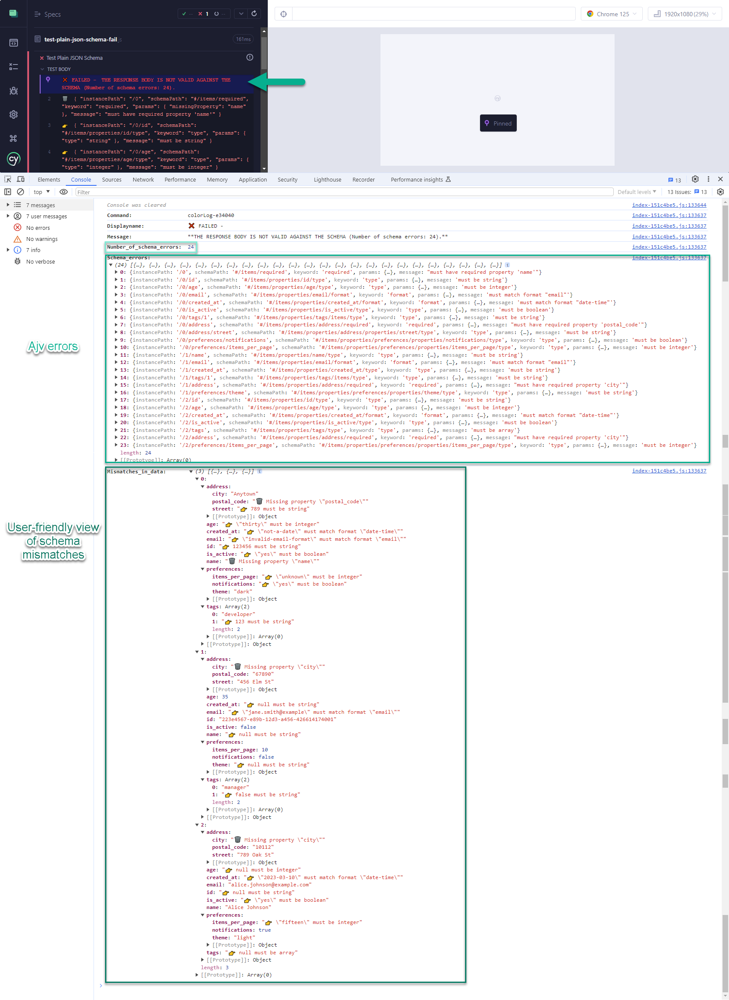

# cypress-ajv-schema-validator

A Cypress plugin for API testing to validate the API response against JSON Schema, Swagger, and OpenAPI documents using Ajv JSON Schema validator.


## Main Features

- Cypress command `cy.validateSchema()` and utility function `validateSchema()` to report JSON Schema validation errors in the response obtained from any network request with `cy.request()`.
  
- The command `cy.validateSchema()` is chainable and returns the original API response yielded.
  
- Schema is provided as a JSON object, that could come from a Cypress fixture.
  
- Can validate schemas provided as a **Plain JSON schema**, **OpenAPI 3.0.1** and **Swagger 2.0** schema documents.
  
- Provides in the Cypress log a summary of the schema errors as well as a list of the individual errors in the schema validation.
  
- By clicking on the validation summary line, it outputs in the console the number of schema errors, a full list of the schema errors as provided by Ajv, as well as a nested tree view of the validated data indicating exactly the errors and where they are happening in an easy-to-understand format.
  
- Ajv JSON Schema Validator was chosen as the core engine because of its versatility, powerful validation capabilities, and excellent documentation. For more information on Ajv, visit [Ajv official website](https://ajv.js.org/).

- The Ajv instance used in this plugin `cypress-ajv-schema-validator` is configured with the options `{ allErrors: true, strict: false }` to show all validation errors and disable strict mode.

&nbsp; 

> ⭐⭐⭐⭐⭐
> **Note:** This plugin complements **Filip Hric** [cypress-plugin-api](https://github.com/filiphric/cypress-plugin-api) and **Gleb Bahmutov** [@bahmutov/cy-api](https://github.com/bahmutov/cy-api) plugins to perform JSON schema validations.
>
> Example usage with these two API plugins:
> `cy.api('/users/1').validateSchema(schema);`

&nbsp; 

- [cypress-ajv-schema-validator](#cypress-ajv-schema-validator)
  - [Main Features](#main-features)
  - [Installation](#installation)
  - [Compatibility](#compatibility)
  - [Configuration](#configuration)
    - [For `cy.validateSchema` Custom Command](#for-cyvalidateschema-custom-command)
    - [For `validateSchema` Function](#for-validateschema-function)
  - [API Reference](#api-reference)
    - [Custom Commands](#custom-commands)
      - [`cy.validateSchema(schema, path)`](#cyvalidateschemaschema-path)
        - [Parameters](#parameters)
        - [Returns](#returns)
        - [Throws](#throws)
    - [Functions](#functions)
      - [`validateSchema(data, schema, path)`](#validateschemadata-schema-path)
        - [Parameters](#parameters-1)
        - [Returns](#returns-1)
        - [Throws](#throws-1)
  - [Usage and Examples](#usage-and-examples)
    - [Example: Using `cy.validateSchema` Command](#example-using-cyvalidateschema-command)
      - [Plain JSON Schema](#plain-json-schema)
      - [OpenAPI 3.0.1](#openapi-301)
      - [Swagger 2.0](#swagger-20)
    - [Example: Using `validateSchema` Function](#example-using-validateschema-function)
      - [OpenAPI 3.0.1](#openapi-301-1)
    - [Example: Using `cy.api()` from Plugin `cypress-plugin-api` or `@bahmutov/cy-api`](#example-using-cyapi-from-plugin-cypress-plugin-api-or-bahmutovcy-api)
  - [Validation Results](#validation-results)
    - [Test Passed](#test-passed)
    - [Test Failed](#test-failed)
      - [Overview of Errors](#overview-of-errors)
      - [Detailed Error View](#detailed-error-view)
    - [Test Failed with More than 10 Errors](#test-failed-with-more-than-10-errors)
      - [Overview with More Errors](#overview-with-more-errors)
      - [Error Details in Console](#error-details-in-console)
      - [More Errors in Console](#more-errors-in-console)
  - [License](#license)
  - [Changelog](#changelog)
    - [\[1.0.0\]](#100)

---

## Installation

```sh
npm install cypress-ajv-schema-validator
```

## Compatibility

- Cypress 12.0.0 or higher
- Ajv 8.16.0 or higher
- ajv-formats 3.0.1 or higher

## Configuration

Add the following lines either to your `cypress/support/commands.js` to include the custom command and function globally, or directly in the test file that will host the schema validation tests:

### For `cy.validateSchema` Custom Command

```js
import 'cypress-ajv-schema-validator';
```

### For `validateSchema` Function

```js
import validateSchema from 'cypress-ajv-schema-validator';
```

## API Reference

### Custom Commands

#### `cy.validateSchema(schema, path)`

Validates the response body against the provided schema.

##### Parameters

- `schema` (object): The schema to validate against. Supported formats are plain JSON schema, Swagger, and OpenAPI documents.
- `path` (object, optional): The path object to the schema definition in a Swagger or OpenAPI document.
  - `endpoint` (string, optional): The endpoint path.
  - `method` (string, optional): The HTTP method. Defaults to 'GET'.
  - `status` (integer, optional): The response status code. Defaults to 200.

##### Returns

- `Cypress.Chainable`: The response object wrapped in a Cypress.Chainable.

##### Throws

- `Error`: If any of the required parameters are missing or if the schema or schema definition is not found.

### Functions

#### `validateSchema(data, schema, path)`

Validates the given data against the provided schema.

##### Parameters

- `data` (any): The data to be validated.
- `schema` (object): The schema to validate against.
- `path` (object, optional): The path object to the schema definition in a Swagger or OpenAPI document.
  - `endpoint` (string, optional): The endpoint path.
  - `method` (string, optional): The HTTP method. Defaults to 'GET'.
  - `status` (integer, optional): The response status code. Defaults to 200.

##### Returns

- `Array`: An array of validation errors, or null if the data is valid against the schema.

##### Throws

- `Error`: If any of the required parameters are missing or if the schema or schema definition is not found.

## Usage and Examples

### Example: Using `cy.validateSchema` Command

#### Plain JSON Schema

```js
describe('API Schema Validation with Plain JSON', () => {
  it('should validate the user data using plain JSON schema', () => {
    const schema = {
      "type": "object",
      "properties": {
        "name": { "type": "string" },
        "age": { "type": "number" }
      },
      "required": ["name", "age"]
    };

    cy.request('GET', 'https://awesome.api.com/users/1')
      .validateSchema(schema)
      .then(response => {
        // Further assertions
      });
  });
});
```

#### OpenAPI 3.0.1

```js
describe('API Schema Validation with OpenAPI 3.0.1', () => {
  it('should validate the user data using OpenAPI 3.0.1 schema', () => {
    const schema = {
      "openapi": "3.0.1",
      "paths": {
        "/users/{id}": {
          "get": {
            "responses": {
              "200": {
                "content": {
                  "application/json": {
                    "schema": { "$ref": "#/components/schemas/User" }
                  }
                }
              }
            }
          }
        }
      },
      "components": {
        "schemas": {
          "User": {
            "type": "object",
            "properties": {
              "name": { "type": "string" },
              "age": { "type": "number" }
            },
            "required": ["name", "age"]
          }
        }
      }
    };

    const path = { endpoint: '/users/{id}', method: 'GET', status: 200 };

    cy.request('GET', 'https://awesome.api.com/users/1')
      .validateSchema(schema, path)
      .then(response => {
        // Further assertions
      });
  });
});
```

#### Swagger 2.0

```js
describe('API Schema Validation with Swagger 2.0', () => {
  it('should validate the user data using Swagger 2.0 schema', () => {
    const schema = {
      "swagger": "2.0",
      "paths": {
        "/users/{id}": {
          "get": {
            "responses": {
              "200": {
                "schema": { "$ref": "#/definitions/User" }
              }
            }
          }
        }
      },
      "definitions": {
        "User": {
          "type": "object",
          "properties": {
            "name": { "type": "string" },
            "age": { "type": "number" }
          },
          "required": ["name", "age"]
        }
      }
    };

    const path = { endpoint: '/users/{id}', method: 'GET', status: 200 };

    cy.request('GET', 'https://awesome.api.com/users/1')
      .validateSchema(schema, path)
      .then(response => {
        // Further assertions
      });
  });
});
```

### Example: Using `validateSchema` Function

#### OpenAPI 3.0.1

```js
import validateSchema from 'cypress-ajv-schema-validator';

describe('API Schema Validation Function', () => {
  it('should validate the user data using validateSchema function', () => {
    const schema = {
      "openapi": "3.0.1",
      "paths": {
        "/users/{id}": {
          "get": {
            "responses": {
              "200": {
                "content": {
                  "application/json": {
                    "schema": { "$ref": "#/components/schemas/User" }
                  }
                }
              }
            }
          }
        }
      },
      "components": {
        "schemas": {
          "User": {
            "type": "object",
            "properties": {
              "name": { "type": "string" },
              "age": { "type": "number" }
            },
            "required": ["name", "age"]
          }
        }
      }
    };

    const path = { endpoint: '/users/{id}', method: 'GET', status: 200 };

    cy.request('GET', 'https://awesome.api.com/users/1').then(response => {
      const errors = validateSchema(response.body, schema, path);
      
      expect(errors).to.have.length(0); // Assertion to ensure no validation errors
    });
  });
});
```

### Example: Using `cy.api()` from Plugin `cypress-plugin-api` or `@bahmutov/cy-api`

```js
import 'cypress-plugin-api';
// or
// import '@bahmutov/cy-api'

describe('API Schema Validation using cy.api()', () => {
  it('should validate the user data using OpenAPI 3.0.1 schema', () => {
    const schema = {
      "openapi": "3.0.1",
      "paths": {
        "/users/{id}": {
          "get": {
            "responses": {
              "200": {
                "content": {
                  "application/json": {
                    "schema": { "$ref": "#/components/schemas/User" }
                  }
                }
              }
            }
          }
        }
      },
      "components": {
        "schemas": {
          "User": {
            "type": "object",
            "properties": {
              "name": { "type": "string" },
              "age": { "type": "number" }
            },
            "required": ["name", "age"]
          }
        }
      }
    };

    const path = { endpoint: '/users/{id}', method: 'GET', status: 200 };

    cy.api('/users/1').validateSchema(schema, path);
  });
});
```

## Validation Results

Here are some screenshots of schema validation tests run in Cypress.

### Test Passed


### Test Failed

#### Overview of Errors


In the Cypress log, the number of errors is summarized, and the schema validation errors are listed in AJV format. Missing fields in the validated data are shown with the symbol 🗑️, and the rest of the errors with the symbol 👉.

#### Detailed Error View


When clicking on the summary line, the number of errors, the full list of errors in AJV format, and a view of the validated data indicating the errors in a user-friendly format are shown.

### Test Failed with More than 10 Errors

#### Overview with More Errors


At the end of the list of individual errors, a line "...and N more errors." is shown.

#### Error Details in Console



When clicking the summary line in the Cypress log, the error details are shown in the console.

#### More Errors in Console


When clicking on the "...and N more errors." line in the Cypress log, additional error details are shown in the console.

## License

This project is licensed under the MIT License. See the [LICENSE](LICENSE) file for more details.

## Changelog

### [1.0.0]
- Initial release.
